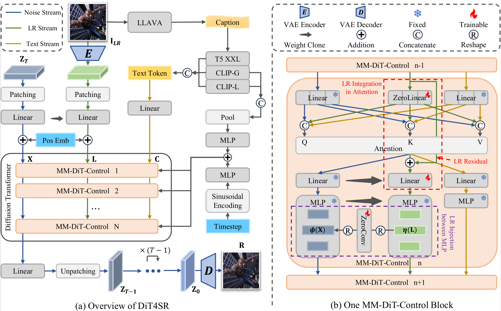

# :fire: DiT4SR: Taming Diffusion Transformer for Real-World Image Super-Resolution (ICCV2025)

<a href='https://arxiv.org/abs/2503.23580'></a> &nbsp;&nbsp;
<a href='https://adam-duan.github.io/projects/dit4sr/'></a> &nbsp;&nbsp;
<a href='https://huggingface.co/datasets/acceptee/NKUSR8K'></a> &nbsp;&nbsp;
<a href='https://huggingface.co/spaces/acceptee/DiT4SR'></a> &nbsp;&nbsp;


This is the official PyTorch codes for the paper:

>**DiT4SR: Taming Diffusion Transformer for Real-World Image Super-Resolution**<br>  [Zheng-Peng Duan<sup>1,2 *</sup>](https://adam-duan.github.io/), [Jiawei Zhang<sup>2</sup>](https://sites.google.com/site/zhjw1988), [Xin Jin<sup>1</sup>](https://srameo.github.io/), [Ziheng Zhang<sup>1</sup>](https://men1sc.us/), [Zheng Xiong<sup>2</sup>](), [Dongqing Zou<sup>2,3</sup>](https://sites.google.com/view/dongqingzou/), [Jimmy S. Ren<sup>2,4</sup>](https://www.jimmyren.com/), [Chunle Guo<sup>1</sup>](https://scholar.google.com/citations?user=RZLYwR0AAAAJ&hl=en), [Chongyi Li<sup>1 &dagger;</sup>](https://li-chongyi.github.io/) <br>
> <sup>1</sup> VCIP, CS, Nankai University, <sup>2</sup> SenseTime Research, <sup>3</sup> PBVR, <sup>4</sup> Hong Kong Metropolitan University <br>
> <sup>*</sup>This project is done during the internship at SenseTime Research. <br> <sup>&dagger;</sup>Corresponding author.




:star: If DiT4SR is helpful to your images or projects, please help star this repo. Thank you! :point_left:

---

## :boom: News

- **2025.07.07** Create this repo and release related code of our paper.

## :runner: TODO
- [x] ~~Release a huggingface demo~~
- [x] ~~Release Checkpoints~~
- [x] ~~Release NKUSR8K dataset~~
- [x] ~~Release training and inference code~~


## :wrench: Dependencies and Installation

1. Clone repo

```bash
git clone https://github.com/adam-duan/DiT4SR.git
cd DiT4SR
```

2. Install packages
```bash
conda env create -f environment.yaml
```


## :surfer: Quick Inference


**Step 1: Download Checkpoints**

- Download the [[dit4sr_f and dit4sr_q](https://huggingface.co/acceptee/DiT4SR)] checkpoints and place them in the following directories: `preset/dit4sr_f` and `preset/dit4sr_q`.
- Download the [[stable-diffusion-3.5-medium](https://huggingface.co/stabilityai/stable-diffusion-3.5-medium)] checkpoints and place it in the `preset/stable-diffusion-3.5-medium` directory.
- Download the [[clip-vit-large-patch14-336](https://huggingface.co/openai/clip-vit-large-patch14-336)] and [[
llava-v1.5-13b](https://huggingface.co/liuhaotian/llava-v1.5-13b)] and place them in the `llava_ckpt` directory.

**Step 2: Prepare testing data**

Place low-quality images in `preset/datasets/test_datasets/`.
You can download `RealSR`, `DrealSR` and `RealLR200` from [[SeeSR](https://drive.google.com/drive/folders/1L2VsQYQRKhWJxe6yWZU9FgBWSgBCk6mz)], 
and download `RealLQ250` from [[DreamClear](https://drive.google.com/file/d/16uWuJOyGMw5fbXHGcl6GOmxYJb_Szrqe/view)].
Thanks for their awesome works.

**Step 3: Running testing command**

```bash
# test w/o llava, one GPU is enough
bash bash/test_wllava.sh

# test w/ llava, two GPUs are required
bash bash/test_wollava.sh
```
Replace the placeholders `[pretrained_model_name_or_path]`, `[transformer_model_name_or_path]`, `[image_path]`, `[output_dir]`, and `[prompt_path]` with their respective paths before running the command.

**Step 4: Check the results**

The processed results will be saved in the `[output_dir]` directory.

<!-- **:seedling: Gradio Demo** -->
## :gift: Gradio Demo
We provide a gradio demo for DiT4SR, which is the same with <a href='https://huggingface.co/spaces/acceptee/DiT4SR'></a> &nbsp;&nbsp;. You can use the demo to test your own images.
```bash
CUDA_VISIBLE_DEVICES=0,1 python gradio_dit4sr.py \
    --transformer_model_name_or_path "preset/models/dit4sr_f" 
```
Note that `dit4sr_q` achieves superior performance in terms of perceptual quality, while `dit4sr_f` better preserves image fidelity. All results reported in this paper are generated using `dit4sr_q`.


## :muscle: Train

**Step 1: Download the training data**

Download the training datasets including `DIV2K`, `DIV8K`, `Flickr2K`, `Flickr8K`, and our [[`NKUSR8K`](https://huggingface.co/datasets/acceptee/NKUSR8K)] dataset.

**Step 2: Prepare the training data**

- Following [[SeeSR](https://github.com/cswry/SeeSR)], you can generate the LR-HR pairs for training using `bash_data/make_pairs.sh`.
- Using `bash_data/make_prompt.sh` to generate the prompts for each HR image.
- Using `bash_data/make_latent.sh` to generate the latent codes for both HR and LR images.
- Using `bash_data/make_embedding.sh` to generate the embedding for each prompt.
- Don't forget to download [[NULL_pooled_prompt_embeds.pt and NULL_prompt_embeds.pt](https://huggingface.co/acceptee/DiT4SR)] and place them in the corresponding directories.

**Data Structure After Preprocessing**

```
preset/datasets/training_datasets/ 
    └── gt
        └── 0000001.png # GT images, (3, 512, 512)
        └── ...
    └── sr_bicubic
        └── 0000001.png # Bicubic LR images, (3, 512, 512)
        └── ...
    └── prompt_txt
        └── 0000001.txt # prompts for teacher model and lora model
        └── ...
    └── prompt_embeds
        └── NULL_prompt_embeds.pt # SD3 prompt embedding tensors, (154, 4096)
        └── 0000001.pt 
        └── ...
    └── pooled_prompt_embeds
        └── NULL_pooled_prompt_embeds.pt # SD3 pooled embedding tensors, (2048,)
        └── 0000001.pt 
        └── ...
    └── latent_hr
        └── 0000001.pt # SD3 latent space tensors, (16, 64, 64)
        └── ...
    └── latent_lr
        └── 0000001.pt # SD3 latent space tensors, (16, 64, 64)
        └── ...
```

**Step 3: Start train**

Use the following command to start the training process:

```bash
bash bash/train.sh
```


## 📜 License

This project is licensed under the Pi-Lab License 1.0 - see the [LICENSE](LICENSE) file for details.

## :book: Citation

If you find our repo useful for your research, please consider citing our paper:

```bibtex
@inproceedings{duan2025dit4sr,
  title={DiT4SR: Taming Diffusion Transformer for Real-World Image Super-Resolution},
  author={Duan, Zheng-Peng and Zhang, Jiawei and Jin, Xin and Zhang, Ziheng and Xiong, Zheng and Zou, Dongqing and Ren, Jimmy and Guo, Chun-Le and Li, Chongyi},
  booktitle={Proceedings of the IEEE/CVF International Conference on Computer Vision},
  year={2025}
}
```

## :postbox: Contact

For technical questions, please contact `adamduan0211[AT]gmail.com`
